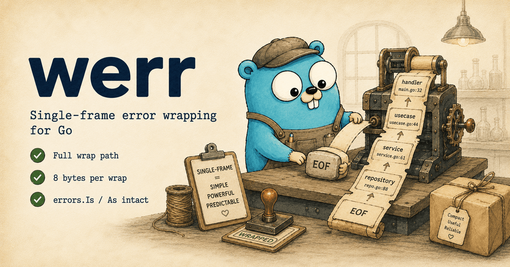

# `werr`: single-frame error wrapping for Go

[](https://github.com/gokern/werr/actions/workflows/ci.yml)
[](https://github.com/gokern/werr/actions/workflows/lint.yml)
[](https://github.com/gokern/werr/actions/workflows/codeql.yml)
[](https://pkg.go.dev/github.com/gokern/werr/v2)
[](go.mod)
[](https://github.com/gokern/werr/releases)
[](LICENSE)

<p align="center">
  
</p>

Something fails in production. The log says `EOF` and you have no idea which of twelve possible places that came from.

That's the gap `werr` closes. You wrap an error, werr remembers the line you wrapped it on, and when the error finally lands in a log or `slog` you get the full propagation path: file, line, function for every wrap site. Like a stack trace, but only for the points you cared enough to mark.

It costs 8 bytes per wrap, the file/line lookup happens lazily on render, and stdlib `errors.Is`/`As` still work.

## Install

```sh
go get github.com/gokern/werr/v2
```

Requires Go 1.26+. One dependency, [`gokern/panics`](https://github.com/gokern/panics), which has none of its own.

## Example

Each layer wraps the error as it propagates up. The top of the chain renders it once:

```go
func repository() (User, error) {
    return User{}, werr.Wrap(io.EOF)
}

func service() (User, error) {
    return werr.Wrap2(repository())            // Wrap2: forward (T, error) in one line
}

func usecase() (User, error) {
    u, err := service()
    return u, werr.Wrapf(err, "load user profile")
}

func handler(w http.ResponseWriter, r *http.Request) {
    u, err := usecase()
    if err != nil {
        log.Println(werr.Wrapf(err, "GET /users/%d", 42))
        return
    }
    _ = json.NewEncoder(w).Encode(u)
}
```

Default `PrettyFormatter` output:

```
GET /users/42
 --- at main/main.go:51 (handler)
Caused by: load user profile
 --- at main/main.go:44 (usecase)
 --- at main/main.go:37 (service)
 --- at main/main.go:32 (repository)
Caused by: EOF
```

Same chain through `OneLineFormatter` for Loki/ELK/grep:

```
GET /users/42 at main.go:51 (handler) -> load user profile at main.go:44 (usecase) -> main.go:37 (service) -> main.go:32 (repository) -> EOF
```

All wrap functions return `nil` for a `nil` input, so `return werr.Wrap(err)` and `return werr.Wrap2(svc.Do())` are safe unconditionally; no `if err != nil` guard needed.

A runnable version lives in [`_examples/demo/main.go`](_examples/demo/main.go). `go run ./_examples/demo` prints the output for every formatter and inspection API.

## API

### Wrap

```go
err = werr.Wrap(err)                            // capture frame, no message
err = werr.Wrapf(err, "loading %s", path)       // capture frame + formatted message
v, err := werr.Wrap2(svc.Do(ctx))               // forward (T, error) in one line
img, format, err := werr.Wrap3(image.Decode(r)) // forward (T1, T2, error) in one line
```

### Inspect

```go
werr.IsWrap(err)                  // any werr.Error in the chain?
if w, ok := werr.AsWrap(err); ok {
    log.Println(w.FuncName(), w.File(), w.Line())
}

werr.Strip(err)                   // remove one werr layer
werr.StripAll(err)                // remove all consecutive werr layers
werr.Walk(err, func(f werr.Frame) bool { /* zero-alloc iteration */ return true })
```

`IsWrap` and `AsWrap` traverse the full chain, so they still find a werr layer hidden behind `fmt.Errorf("ctx: %w", werr.Wrap(...))`.

### Recovered panics

werr does not recover panics — containing one is a separate job, and [`gokern/panics`](https://github.com/gokern/panics) does it. werr renders what comes back:

```go
func deliver(msg Message) error {
    if p := panics.Catch(func() { handler(msg) }); p != nil {
        return werr.Wrapf(p, "delivering message %d", msg.ID)
    }
    return nil
}
```

| channel | what it shows |
|---|---|
| `Pretty` | the panic's frames, in the same `--- at` shape as wrap frames |
| `OneLine` | one further segment: `panic at handler.go:16 (handler)` |
| `LogValue` | a `panicFrames` array, present only when there is a panic |
| `Callers` | werr's own wrap sites only |

All three channels find the panic with `panics.As`, which reaches it through `errors.Join` and `fmt.Errorf("%w: %w", ErrSentinel, p)` — the shapes a panic actually arrives in. The wrap is optional for rendering: `werr.Pretty(p)` on a panic straight out of `Catch` prints the same stack that `werr.Pretty(werr.Wrap(p))` does.

`Callers` stays out of it on purpose: a recovered panic carries a complete goroutine stack down to `runtime.goexit`, and the wrap sites are frames from that same stack, so splicing the two produces a trace that cannot exist. Reach the panic stack through `panics.As(err).StackTrace()`, which is also where sentry-go finds it by reflection.

## Formatters

One global setting decides how every `err.Error()` renders in the program. Two built-ins:

```go
werr.SetFormatter(werr.PrettyFormatter)   // default: multi-line, "Caused by:" blocks; for terminals
werr.SetFormatter(werr.OneLineFormatter)  // single line, no \n/\r/\t; for Loki/ELK/grep
```

Or render a one-off without changing the global:

```go
fmt.Println(werr.Pretty(err))
fmt.Println(werr.OneLine(err))
```

### Sending werr errors to Sentry / OpenTelemetry / Datadog

`*werr.Error` implements `StackTrace() []uintptr`, the duck-typed protocol `sentry-go` looks up by reflection. `sentry.CaptureException(err)` picks up the wrap-site stack with no glue code and no helper sub-package to import.

The panic case needs nothing extra either. Sentry builds one exception per link in the chain, and `*panics.Panic` answers the same protocol, so the panic frames arrive under their own entry while the werr entries carry the wrap sites.

```go
err := werr.Wrapf(loadConfig(), "boot")
sentry.CaptureException(err) // resolved stack frames appear in Sentry.
```

For other APM SDKs, use `werr.Callers(err)` and feed the result through `runtime.CallersFrames`:

```go
pcs := werr.Callers(err)
if len(pcs) > 0 {
    frames := runtime.CallersFrames(pcs)
    for {
        f, more := frames.Next()
        // f.Function, f.File, f.Line — feed into your APM's frame type.
        if !more {
            break
        }
    }
}
```

`Callers` returns frames in innermost-first order (closest to the leaf at index 0), matches the `runtime.Callers` convention, allocates exactly one slice, and stops at the first non-werr link in the chain. It reports only wrap sites werr captured itself — for a recovered panic's own stack, use `panics.As(err).StackTrace()`.

### Custom formatters

`FormatFn` is a public function type. Plug in your own and every `err.Error()` in the program goes through it. The example below is the lower-level path: a formatter that renders every `err.Error()` as Sentry-style text. If you actually call sentry-go, prefer the `StackTrace()` pickup or the `Callers` recipe above; this path is for log pipelines that never touch the SDK.

```go
// Render werr chains as Sentry-style stack frames.
werr.SetFormatter(func(frames []werr.Frame, leaf error) string {
    var b strings.Builder
    for _, f := range frames {
        fmt.Fprintf(&b, "%s\n  at %s (%s:%d)\n", f.Msg, f.FuncName, f.File, f.Line)
    }
    if leaf != nil {
        b.WriteString(leaf.Error())
    }
    return b.String()
})
```

The function is called exactly once per `err.Error()` invocation, with the full slice of werr-frames (outermost first) and the leaf error underneath. The swap itself is concurrency-safe (`atomic.Pointer`).

## Structured logging (`log/slog`)

`*werr.Error` implements `slog.LogValuer`, so the standard logger emits werr chains as nested groups automatically:

```go
slog.Error("op failed", "err", err)
```

```json
{
  "level": "ERROR",
  "msg": "op failed",
  "err": {
    "msg": "EOF",
    "frames": [
      {"func": "main.handler", "file": ".../main.go", "line": 51, "msg": "GET /users/42"},
      {"func": "main.usecase", "file": ".../main.go", "line": 44, "msg": "load user profile"}
    ]
  }
}
```

Every frame has the same set of fields, even when `msg` is empty, so log dashboards can rely on consistent field presence.

## Performance

<p align="center">
  
  
</p>

A single-request lifecycle benchmarked against 17 other Go error-wrapping libraries. werr's per-iteration cost sits next to the stdlib baseline while still capturing a call site at every wrap. Methodology and tables: [`benchmark/BENCHMARK.md`](benchmark/BENCHMARK.md).

## Scope

`werr` is for the propagation step: capturing where an error was wrapped, and rendering that path when it's actually logged. It isn't a full-stack tracing library or a structured-error framework, so pair it with whatever observability stack you already use. If you need full goroutine stacks at every wrap, `cockroachdb/errors` or `eris` are better fits. For rich per-layer context with attributes, `samber/oops` is built around that.
