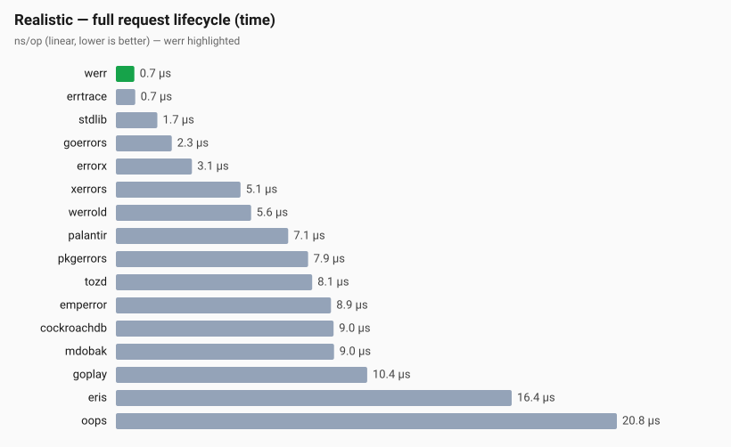
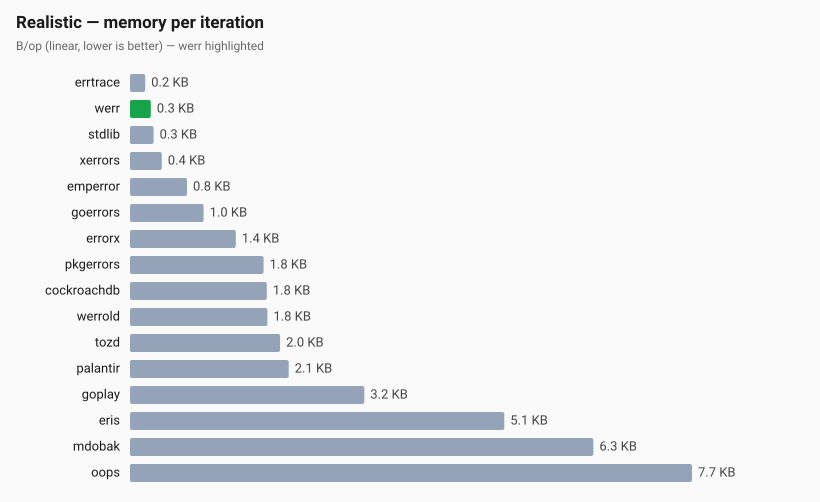
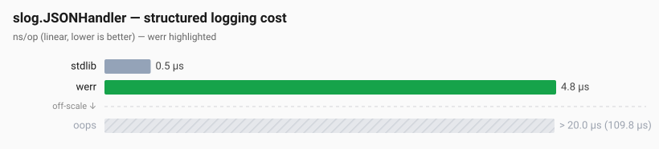
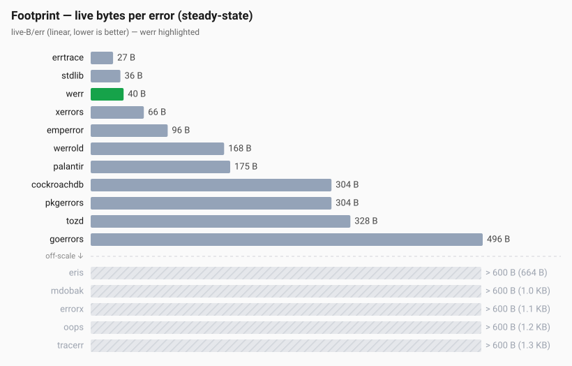

# werr benchmark suite

Cross-library comparison of [`github.com/gokern/werr`](https://github.com/gokern/werr)
against 17 other Go error-wrapping libraries. Each library runs through
its own idiomatic API. The question the suite is built to answer: in a
typical request lifecycle, how much does each library cost in time and
in bytes?





Where a chart shows off-scale bars (muted gray, hatched), those are
libraries past its linear cutoff, and the parenthesised number is the
actual value. In the current results only the footprint chart has any;
the two above fit entirely on scale. Full tables and methodology below.

## How to read the tables

Every column comes straight from `go test -bench`:

| Column | Meaning |
|---|---|
| `ns/op` | nanoseconds per iteration (lower is better) |
| `B/op` | heap bytes allocated per iteration (lower is better) |
| `allocs/op` | distinct heap allocations per iteration (lower is better) |

A library scoring `0 allocs/op` on Realistic is at steady state with no
heap traffic during the wrap chain. Its wrap call site is invisible to
the GC.

## Libraries under test

Stdlib baselines:

| Alias | Import | Notes |
|---|---|---|
| `stdlib` | `errors`, `fmt` | `errors.New` + `fmt.Errorf("%w", ...)` |
| `xerrors` | `golang.org/x/xerrors` | historic stdlib precursor (frame capture) |

Core wrap libraries:

| Alias | Import | Notes |
|---|---|---|
| `werr` | `github.com/gokern/werr` | single PC, lazy resolve |
| `werrold` | `github.com/safeblock-dev/werr` | older werr release tracked as a regression baseline (eager file/line/func) |
| `pkgerrors` | `github.com/pkg/errors` | classic; full goroutine stack |
| `palantir` | `github.com/palantir/stacktrace` | one frame per Propagate |
| `errorx` | `github.com/joomcode/errorx` | full stack, typed namespaces |
| `goerrors` | `github.com/go-errors/errors` | full stack; dedups wraps |
| `cockroachdb` | `github.com/cockroachdb/errors` | full stack plus many extras |
| `eris` | `github.com/rotisserie/eris` | modern, full stack |
| `errtrace` | `braces.dev/errtrace` | `//line` directive trick (no `runtime.Callers`) |
| `oops` | `github.com/samber/oops` | full stack, rich context |
| `emperror` | `emperror.dev/errors` | drop-in `pkg/errors` replacement |
| `tracerr` | `github.com/ztrue/tracerr` | full stack plus source excerpts |

Modern alternatives:

| Alias | Import | Notes |
|---|---|---|
| `tozd` | `gitlab.com/tozd/go/errors` | claims "fast"; recent design |
| `mdobak` | `github.com/mdobak/go-xerrors` | slog-first stack-capture; does not implement `slog.LogValuer`, so it appears in wrap/print/footprint comparisons but not in slog |
| `goplay` | `github.com/go-playground/errors/v5` | stable, niche |

Each library is invoked through its own idiomatic public wrap API as
documented in its README. No library is reshaped just to even out cost.

### Wrap call shape: three idiomatic API surfaces

The realistic bench exercises every library through three call shapes
per iteration. Each library uses its own native API for each shape;
libraries that don't have an equivalent fall back to stdlib.

| shape | when used | what it models |
|---|---|---|
| `bareLeaf()` | 2/6 of iterations | a fresh leaf with no contextual data, typical sentinel-style error |
| `msgLeaf(id)` | 1/6 of iterations | a leaf wrapping `sentinelImport` with a per-request context message, typical "boundary" error |
| `wrap(err)` | every chain layer | message-less propagation, what most layers above the boundary do |

The other 3/6 of iterations skip leaf creation and pass through
`sentinelImport` directly, modelling errors imported from third-party
packages (`sql.ErrNoRows`, `io.EOF`, `context.Canceled`).

Per-library calls:

| lib | bareLeaf | msgLeaf | wrap |
|---|---|---|---|
| `stdlib` | `errors.New("not found")` | `fmt.Errorf("user %d: %w", id, sentinel)` | `fmt.Errorf("%w", err)` |
| `xerrors` | `xerrors.New(...)` | `xerrors.Errorf("user %d: %w", id, sentinel)` | `xerrors.Errorf(": %w", err)` (`": %w"` avoids xerrors's quadratic bare-`"%w"` path) |
| `werr` | `werr.Wrap(errors.New("not found"))` | `werr.Wrapf(sentinel, "user %d", id)` | `werr.Wrap(err)` |
| `werrold` | `errors.New(...)` (legacy lacks `New`) | `werrold.Wrapf(sentinel, "user %d", id)` | `werrold.Wrap(err)` |
| `pkgerrors` | `pkgerrors.New(...)` | `pkgerrors.Wrapf(sentinel, "user %d", id)` | `pkgerrors.WithStack(err)` |
| `cockroachdb` | `cockroach.New(...)` | `cockroach.Wrapf(sentinel, ...)` | `cockroach.WithStack(err)` |
| `emperror` | `emperror.New(...)` | `emperror.Wrapf(sentinel, ...)` | `emperror.WithStack(err)` |
| `errorx` | `errorx.IllegalState.New(...)` | `errorx.Decorate(sentinel, "user %d", id)` (`IllegalState.Wrap` deliberately hides the original from `errors.Is`; `Decorate` preserves it) | `errorx.Decorate(err, "")` (`EnsureStackTrace` dedups) |
| `goerrors` | `goerrors.New(...)` | `goerrors.WrapPrefix(sentinel, "user %d", 0)` | `goerrors.WrapPrefix(err, "", 0)` (`Wrap` dedups) |
| `eris` | `eris.New(...)` | `eris.Wrapf(sentinel, ...)` | `eris.Wrap(err, "")` (empty string is the only msg-less form) |
| `palantir` | `stacktrace.NewError(...)` | `stacktrace.Propagate(sentinel, "user %d", id)` | `stacktrace.Propagate(err, "")` (`Propagate` does not expose `Unwrap`, so `errors.Is` short-circuits at the first palantir wrapper; palantir users use `stacktrace.RootCause` instead) |
| `oops` | `oops.New(...)` | `oops.Wrapf(sentinel, ...)` | `oops.Wrapf(err, "")` |
| `tozd` | `tozd.New(...)` | `tozd.Wrapf(sentinel, ...)` | `tozd.Wrap(err, "")` (`WithStack` dedups) |
| `goplay` | `goplay.New(...)` | `goplay.Wrapf(sentinel, ...)` | `goplay.Wrap(err, "")` |
| `errtrace` | `errtrace.Wrap(errors.New(...))` | `errtrace.Wrap(fmt.Errorf("user %d: %w", id, sentinel))` | `errtrace.Wrap(err)` (no native msg API) |
| `mdobak` | `mdobak.WithStackTrace(errors.New(...), 0)` | `mdobak.WithStackTrace(fmt.Errorf(...), 0)` | `mdobak.WithStackTrace(err, 0)` (no native msg API) |
| `tracerr` | — | — | — | excluded; only `tracerr.Wrap` exists and it dedups by design |

Libraries that capture a goroutine stack on creation (`pkgerrors`,
`cockroachdb`, `eris`, `palantir`, `oops`) pay that cost on `bareLeaf()`,
`msgLeaf()`, and every `wrap()`. werr, errtrace and stdlib pay it only
when they wrap. That's what real users see when they pick those
libraries.

## Scenarios

Three files. Each one models a full use case rather than isolating an
operation a real user wouldn't call by itself.

| File | What it measures |
|---|---|
| `realistic_test.go` | `BenchmarkRealistic_*` — single request lifecycle. Leaf alternates between fresh creation (with or without msg) and import from a third-party sentinel. The chain runs through 5–8 `//go:noinline` call frames so each wrap has a distinct PC, like real production code. Three checks per iteration: one `errors.Is` hit, one `errors.Is` miss, one `errors.As` miss. 1% of iterations format the chain via `err.Error()`. |
| `slog_test.go` | `BenchmarkSlogJSON_*` — `slog.JSONHandler` over a 15-deep wrap chain for libs that implement `slog.LogValuer` (`werr`, `oops`) plus a stdlib baseline. Libs without `LogValue` would just measure the stdlib encoder twice and are excluded. |
| `footprint_test.go` | `BenchmarkFootprint_*` — steady-state memory cost of one retained error. Each iteration appends one factory-produced error to a pre-grown slice; HeapAlloc delta / N is reported as `live-B/err` via `b.ReportMetric`. The same bench also reports `header-B` (`unsafe.Sizeof` of the concrete struct) so static layout info lives in RESULTS.txt next to the dynamic metric. This is distinct from `B/op`: arena-pooled libs (werr, errtrace) amortise allocations across iterations, so `B/op` understates true per-error retained size. |

## How to run

The full suite is light enough to reproduce on a developer laptop. From
the repo root:

```sh
make bench-full       # ~90 sec — writes benchmark/RESULTS.txt and
                      # regenerates benchmark/charts/*.svg from it
```

For finer control:

```sh
# All benchmarks. -cpu 1 for stable numbers, -count for benchstat.
go test -bench '.' -benchtime 3s -cpu 1 -count 5 -run=XXX -benchmem ./...

# Single category.
go test -bench 'Realistic' -benchtime 3s -cpu 1 -count 5 -run=XXX -benchmem ./...

# Single library.
go test -bench '_werr$' -benchtime 3s -cpu 1 -count 5 -run=XXX -benchmem ./...
```

For statistical comparison runs:

```sh
go test -bench '.' -benchtime 3s -cpu 1 -count 5 -run=XXX -benchmem ./... > RESULTS.txt
benchstat RESULTS.txt
```

## Run environment

Reproducibility depends on a documented environment. The Results
section was produced on:

| key | value |
|---|---|
| Go version | `go1.26.5` |
| GOOS / GOARCH | `darwin / arm64` |
| CPU model | `Apple M1` |
| Cores used | `1` (`-cpu 1`) |
| Benchtime | `1s` |
| Count | `3` |
| Library versions | pinned in `benchmark/go.mod` |

The suite is light enough that `-benchtime 1s -count 3` is statistically
sufficient and finishes in ~90 sec.

The competing libraries are ordinary module dependencies, so a
dependency bump moves the numbers below without touching a line of
bench code. Treat `make bench-full` plus a refresh of the Results
tables as part of merging any `benchmark/go.mod` update.

## Caveats

A few things worth knowing before reading the numbers:

Stack-capture libraries pay more per wrap. cockroachdb, errorx, eris
and go-errors capture the full goroutine stack on every wrap; werr,
palantir/stacktrace, pkg/errors and errtrace capture a single frame
(none in errtrace's case). It's a trade-off, not a defect; read the
Realistic numbers with that in mind.

Some libraries dedup their no-arg wrap. `goerrors.Wrap`,
`errorx.EnsureStackTrace`, `tozd.WithStack` and `tracerr.Wrap` return
the input as-is when it's already of their own type. So the realistic
bench uses each lib's message-bearing variant where one exists
(`goerrors.WrapPrefix`, `errorx.Decorate`, `tozd.Wrap`) so the chain
actually grows. `tracerr` has no non-deduping alternative and is
excluded from Realistic.

Some libraries hide the original from `errors.Is`.
`palantir.stacktrace.Propagate` and `errorx.IllegalState.Wrap`
intentionally don't expose `Unwrap`. Palantir users are expected to use
`stacktrace.RootCause`; errorx users use `errorx.Cause` or
`errorx.IsOfType`. The bench picks `errorx.Decorate` (which does
preserve the chain) so its `errors.Is` traversal is measured fairly.
Palantir has no preserving alternative, so its `Is` calls genuinely
short-circuit at the first wrapper, and its numbers reflect that.
That's actual palantir behaviour, not a bench artefact.

One stack shared across prefixes. `goerrors.WrapPrefix` and
`errorx.Decorate` build a real per-layer chain, but the stack trace is
captured only on the first call; subsequent layers share it. werr's
per-layer PC capture is more localised information at a per-layer cost.

Format caching shifts cost. stdlib's `fmt.Errorf("%w", ...)` and
`go-errors` compute the rendered string once at creation; per-call
`Error()` becomes a memoised lookup. werr renders on demand, every call.
The 1% print rate inside Realistic gives both styles a fair window.

`werrold` is a snapshot. The `safeblock-dev/werr` import is an older
release of werr kept here as a regression baseline. Drift in its
upstream version moves that column independently of the current werr.

The Results section is curated. Medians below were eyeballed from
`RESULTS.txt`. For ranges and statistical confidence, run `benchstat
RESULTS.txt` directly.

## Results

Snapshot of medians from one `make bench-full` run (`-benchtime 1s
-cpu 1 -count 3`) on the environment above.

### Realistic — full request lifecycle

One iteration is: leaf production (fresh or imported, with or without
message) + chain ascent through 5–8 `//go:noinline` call frames + 1
`Is` hit + 1 `Is` miss + 1 `As` miss + 1% `Error()`. Sorted by ns/op
ascending. `tracerr` is excluded; its only wrap function deduplicates
by design and has no per-layer alternative. The bar chart for these
numbers is at the top of this document.

| library | ns/op | B/op | allocs/op | notes |
|---|---:|---:|---:|---|
| `werr` | 363 | 266 | 1 | asm PC capture, arena-pooled wrapper |
| `errtrace` | 463 | 185 | 1 | arena-pooled wrap; no native message API, so msg-leaves go through `fmt.Errorf` |
| `stdlib` | 873 | 302 | 12 | no frame capture |
| `goerrors` | 1219 | 1002 | 11 | `WrapPrefix` shares one stack across N prefixes |
| `errorx` | 1629 | 1452 | 9 | `Decorate` shares one stack across N wrappers |
| `xerrors` | 2877 | 417 | 13 | one `Frame` per wrap |
| `werrold` | 3171 | 1894 | 18 | older werr release, eager file/line/func, no arena |
| `palantir` | 3846 | 2193 | 26 | one frame + msg per layer; `errors.Is` short-circuits early (Propagate hides `Unwrap`) |
| `emperror` | 4555 | 770 | 19 | full stack (pkg/errors-style) |
| `pkgerrors` | 4576 | 1841 | 19 | full stack per wrap |
| `tozd` | 4576 | 2073 | 19 | full stack per wrap |
| `cockroachdb` | 5014 | 1886 | 20 | full stack per wrap |
| `mdobak` | 5265 | 6457 | 13 | full stack per wrap |
| `goplay` | 5830 | 3251 | 41 | full stack per wrap |
| `eris` | 9351 | 5210 | 38 | full stack per wrap |
| `oops` | 11804 | 7836 | 67 | full stack + rich context per layer |

The two arena-pooled libraries (werr, errtrace) average 1 alloc/op
because the wrapper itself is reused; the only allocation per iteration
is the leaf (`errors.New` or `fmt.Sprintf`). Everything else allocates
proportionally to the number of wrap layers it captures.

#### Memory per iteration

Same scenario, ranked by `B/op` instead of `ns/op`. The two axes don't
agree: `mdobak` sits in the mid-tier on time but allocates 24× more
bytes per chain than werr. The bar chart is at the top of this document.

### slog rendering

`slog.JSONHandler` writes one error attribute to `io.Discard`. The
attached error is a 15-deep wrap chain.



| library | ns/op | B/op | allocs/op | notes |
|---|---:|---:|---:|---|
| `stdlib` | 472 | 0 | 0 | falls back to `Error()` (cached after first call) |
| `werr` | 4800 | 1128 | 3 | structured group via `LogValuer` |
| `oops` | 8970 | 9393 | 64 | structured group + per-layer attributes |

werr and oops both emit a structured group with per-frame info, which
is the cost of having structured frames in JSON logs at all. stdlib
falls back to a single string `Error()` call (cached after first
invocation) so it has nothing to encode beyond a string.

### Memory footprint per error

Both numbers come from `BenchmarkFootprint_*`: `live-B/err` is the
median `MemStats.HeapAlloc` delta per retained error, and `header bytes`
is `unsafe.Sizeof` of the concrete (dereferenced) error type. The
header value is reported as a second `b.ReportMetric` call so it lives
in RESULTS.txt next to the dynamic metric.



| library | header bytes | live-B/err | notes |
|---|---:|---:|---|
| `errtrace` | 24 | 27 | arena-pooled, no message field |
| `stdlib` | 32 | 36 | |
| `werr` | 40 | 40 | arena-pooled `*Error` |
| `xerrors` | 56 | 66 | one `Frame` per wrap |
| `emperror` | 24 | 96 | |
| `werrold` | 72 | 153 | older werr release, eager file/line/func |
| `palantir` | 80 | 153 | |
| `pkgerrors` | 24 | 304 | full goroutine stack |
| `cockroachdb` | 24 | 304 | full goroutine stack |
| `tozd` | 56 | 328 | |
| `goerrors` | 80 | 496 | |
| `eris` | 48 | 699 | |
| `mdobak` | 40 | 1072 | |
| `oops` | 312 | 1090 | rich context |
| `errorx` | 64 | 1120 | |
| `tracerr` | 40 | 1364 | full stack + source excerpts |

Header bytes is the static struct size; live-B/err includes the
struct, any captured frames, message buffers, and other auxiliary
allocations the library makes per error. For libraries that capture a
full goroutine stack, the bulk of the live cost is the stack frame
slice and its associated strings.
